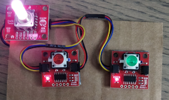

# Ph-UI!!!

For lab this week, we focus on both on sensing, to bring in new modes of input into your devices, as well as prototyping the physical look and feel of the device. You will think about the physical form the device needs to perform the sensing as well as present the display or feedback about what was sensed. 

## Part 1 Lab Preparation

## Deliverables \& Submission for Lab 4

The deliverables for this lab are, writings, sketches, photos, and videos that show what your prototype:
* "Looks like": shows how the device should look, feel, sit, weigh, etc.
* "Works like": shows what the device can do.
* "Acts like": shows how a person would interact with the device.

For submission, the readme.md page for this lab should be edited to include the work you have done:
* Upload any materials that explain what you did, into your lab 4 repository, and link them in your lab 4 readme.md.
* Link your Lab 4 readme.md in your main Interactive-Lab-Hub readme.md. 
* Group members can turn in one repository, but make sure your Hub readme.md links to the shared repository.
* Labs are due on Mondays, make sure to submit your Lab 4 readme.md to Canvas.


## Lab Overview

A) [Capacitive Sensing](#part-a)

B) [OLED screen](#part-b) 

C) [Paper Display](#part-c)

D) [Materiality](#part-d)

E) [Servo Control](#part-e)

F) [Record the interaction](#part-f)

## The Report (Part 1: A-D, Part 2: E-F)


###  Lab Partners: Magdalena Horowitz (myh26) and Lauren Tran (lat89)
## Lab ideas Brainstorming Pad: 
- alarm clock that turns off when it senses you've turned the light on
- coffee machine that tells whne your coffee has the right amount of milk based on the color
- proximity sensor for finding your phone
- snake game with the joystick

## Coffee Idea brainstorm: 
- Light/Proximity/Gesture sensor: tell what color the coffee is
- sensor could be on the milk carton
- could be on the coffee maker
- could be an independent device like a phone camera
- could be on a mug Capacitive Sensing, a.k.a. Human-Twizzler Interaction: gives user a warning that the cup is hot if they touch it too soon Distance Sensor:
- makes sure the user doesn't forget their cofee when they leave

### Part C
### Physical considerations for sensing

Usually, sensors need to positioned in specific locations or orientations to make them useful for their application. Now that you've tried a bunch of the sensors, pick one that you would like to use, and an application where you use the output of that sensor for an interaction. For example, you can use a distance sensor to measure someone's height if you position it overhead and get them to stand under it.

**\*\*\*Draw 5 sketches of different ways you might use your sensor, and how the larger device needs to be shaped in order to make the sensor useful.\*\*\***

# 1.


# 2.


# 3.


# 4.


# 5.


**\*\*\*What are some things these sketches raise as questions? What do you need to physically prototype to understand how to anwer those questions?\*\*\***

Durability of the sensors: one problem is that the sensors need to be very near to hot coffee which could cause problems if the sensor is not water or heat proof. Our first design has the color sensor right on the inside side of the mug which could be very accident prone. To possible account for this, we created another design with the color sensor on the bottom of the mug under a glass or otherwise clear screen that may do a better job of protecting the sensor from hot coffee. This also would prevent the sensor from getting in the way of someone drinking the coffee. It would be difficult to physically protptype to test the durability of the sensors because we do not want to break the sensor. However, we could use a real mug and something disposable such as a piece of paper towel that acts as a sensor and see if the fake sensor gets wet in our prototype.

Weight: Although mugs are typically heavy, adding screens and sensors coudl make the mug more heavy. Our first sketch had the color sensor and display on the mug but our next designs have the display as a separate device that could ideally connect wirelessly to the mug to display the coffee's readiness separate from the mug itself. If the mug is too bulky with all of the sensors, it could take away from the appeal of the mug. To prototype this, we could try using different real mugs and adding the sensors and testing of users feel comfortable lifting the mug. We could try using lightweight plastic mugs and adding the sensors and seeing if the weight is comprable to the weight of a heavier ceramic mug.

Ability to drink from the mug: The sensors could possible hinder people's ability to drink from the mug if they are not placed correctly. If the screen is too close to the handle or the sensor is too close to the lip of the mug, it would be annoying to drink or hold the mug around the sensor so we will need to take into account the most natural and comfortable way for people to hold mugs and build our sensors aroaund the natural grasp. To test this, we could create a cardboard mug or use a real mug and see how people hold the mug. We could then add the sensors to the mug and see if they change the way people grasp the mug or otherwise get in the way of the person's natural handhold.

Ability to wash the mug: The ability to use a dishwasher on a mug is a salient consideration when people buy mugs so it is improtant that the sensors are able to be washed in a dish washer without the sensors prevent spaces from getting clean. To test this, we could create fake sensors and add rthem to the mug and see if the mug is still able to be cleaned with the fake sensors. Prototopying this problem is difficult similar to the first problem because we don't want to actually put the sensors through the dishwasher but by creating fake sensors out of dish washer safe materials, we could mimic the shape of the mug with sensors and see how well the prototype holds up in the dishwasher.

**\*\*\*Pick one of these designs to prototype.\*\*\***


Some of the sensing ideas seemed cool at first but raised a couple of questions. For the gesture sensing option, we'd need to find some way to connect the coffee mug device to the actual coffee maker itself. There would be quite a lot of connectivity issues that might be solved through bluetooth, wires (not ideal), or NFC communication. In order to add milk, sugar, etc based on a gesture, the cups sensors would have to send the signal back to the coffee machine, or we'd also have to implement sensors onto the coffee making machine itself.

Using the distance sensor to greet a user in the morning might end up being intrusive and annoying. While it is good to remind a user to make coffee in the morning, if someone wants to wake up discreetly or wants to practice yoga or meditate in their living room/kitchen area, they would not want a coffee device speaking to them every time they moved close to it. 

Finally, the sensors themselves are relatively big so finding a way to incorporate them into the coffee mug while hiding them but also allowing them to function is a bit tricky. We thought of encasing the light sensor in a internal glass inner layer, so it is water resistant and is protected from all liquids. The distance sensor could be placed on the handle, but it too must be protected from damage while still allowing access to its surroundings to perform its sensing capabilities.

We decided that options 4 and 5 would work best with our coffee mug and would provide the most interactive and useful user experience. By determining the RGB content of the coffee color, the device would be unique and be able to add value by telling the user if the coffee color is related or matches the user's preference for coffee. This way, the user would always know when to add more milk to get the perfect cup of coffee every time. 

Option 5 would also be extremely useful, because sometimes when you pour a cup of coffee, you step away for a minute to do other tasks as it's brewing. With the distance sensor, the device could warn you that you are getting too far away and remind you to pick up and drink your cup of coffee. No more cups of coffee wasted!

### Part D
### Physical considerations for displaying information and housing parts

 
**\*\*\*Sketch 5 designs for how you would physically position your display and any buttons or knobs needed to interact with it.\*\*\***

# 1. 


# 2.


# 3.


# 4.


# 5.


**\*\*\*What are some things these sketches raise as questions? What do you need to physically prototype to understand how to anwer those questions?\*\*\***

Display: One difficult part to figure out was where to put the display on the mug to make it easy to read. Our first sketch has the display on the side which we thought was a pretty design but may be difficult for the user to read since the mug must be set on its bottom (rather than its side) when the mug is used. We also figured it may be hard to read the device if the display is on the side incase people are holding the mug and covering the display which led us to the idea of having a projected display. We also played with the idea of using a separate device with a display as well. 

Color sensor: Our sketches also brought up the question of how the color sensor could see the color of the coffee without actually being in contact with the cofee which could be dangerous. We did not want the sensor right in the device so we found out it was probably best to use a clear glass mug similar to a mason jar to place the color sensor on the outside while still being able to sense through the mug the color of the coffee. 

Weight: As we were drawing the sketches, there were many sensors that we originally wanted in the device which may greatly increase the weight of the mug. The tricky part is balancing the amount of hardware on the device to increase functionality and interaction with the actual weight and usability of the device itself.

The mug may need to need to be larger, taller, or a little heavier to implement all the desired features.

**\*\*\*Pick one of these display designs to integrate into your prototype.\*\*\***

We decided that design 5 would most likely incorporate the most features while maintaining usability. 

**\*\*\*Explain the rationale for the design.\*\*\*** (e.g. Does it need to be a certain size or form or need to be able to be seen from a certain distance?)

Build a cardbord prototype of your design.

** See photos: ** 


** See photo ** 


**\*\*\*Document your rough prototype.\*\*\***

See the pictures below for the rough prototype wizarded with current materials. 
The RGB sensor at the bottom of the mug will be encased in class, sealed off from liquid damage, but will still be able to view the color of the liquid through a glass material.

The distance sensor will remain on the side of the mug and the display screen will sit on the side. 


# ** ACTUAL PROTOTYPE: See the progression of coffee shades that the device will detect: ** 


LAB PART 2

### Part 2

Following exploration and reflection from Part 1, complete the "looks like," "works like" and "acts like" prototypes for your design, reiterated below.

### Prototype Final Summary
#### Looks like:
To show what the device will look like, we created a paper prototype, a paper/pi prototype, and a physical prototype.  Because we wanted our display to have color, we were unable to use the mini scren for a functional prototype and needed to use the large screen that attached directly onto the pi which was difficult to integrate into a 3d physical prototype. To illutrate the shape of the device, we found it was better to create a fully paper prototype to be able to mimic what the mug would look like with the sensors seamlessly integrated. This prototype was unable to capture the weight of the prototype but gave a better visual as to the functionalities and overall look of the device. Because we wanted to use color, we used the larger screen to create a prototype with paper and the pi. This allowed us to show how the device dislay would look built into the mug. The bulkiness of the pi made it difficult to create a mug shape around it so we decided to make this prototype 2d. Our last physical prototype made with the glass mason jar and the sensors attached illustrates the weight and feel of the prototype. We wanted to be able to mimic the weight of a normal sized mug with the attached sensors. This prototype did not look exactly like our intended device but gave the feel of the device to users. 

Paper:
Paper/Pi:
Physical: 

#### Works like and looks like: 
To show how the device works and how users should interact with the device, we filmed these videos that showcased the 3 features of the mug. The first video shows how users can input the desired color of their coffee and how the device will prompt users to continue adding milk to their coffee until it reaches the desired color. 

Video: https://drive.google.com/file/d/1rlTBrCd26Wl3r7FdVF-HJ4vJsTM7d3SB/view?usp=sharing

### Part E (Optional)
### Servo Control with Joystick

In the class kit, you should be able to find the [Qwiic Servo Controller](https://www.sparkfun.com/products/16773) and [Micro Servo Motor SG51](https://www.adafruit.com/product/2201). The Qwiic Servo Controller will need external power supply to drive, which we will be distributing the battery packs in the class. Connect the servo controller to the miniPiTFT through qwiic connector and connect the external battery to the 2-Pin JST port (ower port) on the servo controller. Connect your servo to channel 2 on the controller, make sure the brown is connected to GND and orange is connected to PWM.


In this exercise, we will be using the nice [ServoKit library](https://learn.adafruit.com/16-channel-pwm-servo-driver/python-circuitpython) developed by Adafruit! We will continue to use the `circuitpython` virtual environment we created. Activate the virtual environment and make sure to install the latest required libraries by running:

```
(circuitpython) pi@ixe00:~/Interactive-Lab-Hub/Lab 4 $ pip3 install -r requirements.txt
```

A servo motor is a rotary actuator or linear actuator that allows for precise control of angular or linear position. The position of a servo motor is set by the width of an electrical pulse, that is, we can use PWM (pulse-width modulation) to set and control the servo motor position. You can read [this](https://learn.adafruit.com/adafruit-arduino-lesson-14-servo-motors/servo-motors) to learn a bit more about how exactly a servo motor works.

Now that you have a basic idea of what a servo motor is, look into the script `qwiic_servo_example.py` we provide. In line 14, you should see that we have set up the min_pulse and max_pulse corresponding to the servo turning 0 - 180 degree. Try running the servo example code now and see what happens:

```
(circuitpython) pi@ixe00:~/Interactive-Lab-Hub/Lab 4 $ python servo_test.py
```

It is also possible to control the servo using the sensors mentioned in as in part A and part B, and/or from some of the buttons or parts included in your kit, the simplest way might be to chain Qwiic buttons to the other end of the Qwiic OLED. Like this:

<p align="center"> </p>

You can then call whichever control you like rather than setting a fixed value for the servo. For more information on controlling Qwiic devices, Sparkfun has several python examples, such as [this](https://learn.sparkfun.com/tutorials/qwiic-joystick-hookup-guide/all#python-examples).

We encourage you to try using these controls, **while** paying particular attention to how the interaction changes depending on the position of the controls. For example, if you have your servo rotating a screen (or a piece of cardboard) from one position to another, what changes about the interaction if the control is on the same side of the screen, or the opposite side of the screen? Trying and retrying different configurations generally helps reveal what a design choice changes about the interaction -- _make sure to document what you tried_!

### Part F
### Record

Document all the prototypes and iterations you have designed and worked on! Again, deliverables for this lab are writings, sketches, photos, and videos that show what your prototype:
* "Looks like": shows how the device should look, feel, sit, weigh, etc.
* "Works like": shows what the device can do
* "Acts like": shows how a person would interact with the device

